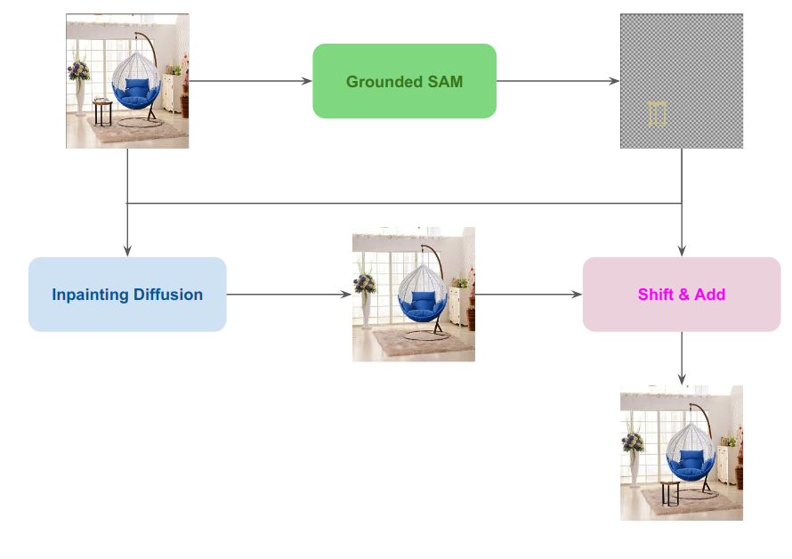

# Object-Shifting

## Pipeline


## Models Used

The following models are integral to the functionality of this project:

- **Grounded SAM**: A model that specializes in semantic segmentation and object grounding, enabling detailed analysis and manipulation of images.
- **Stable Diffusion Inpainting**: Utilized for its state-of-the-art inpainting abilities, allowing for seamless modifications and enhancements to images.
- **Stable Diffusion Image Variation**:  Minor experiment to try out improvements on corrupted images - not an essential component.

## Installation and Usage

Follow these steps to set up the environment and run the pipeline:

```
pip install -r requirements.txt
```

**Clone the GroundedSAM and Zero123 repositories into the specified directories within this project:**

```
git clone https://github.com/IDEA-Research/Grounded-Segment-Anything.git
git https://github.com/cvlab-columbia/zero123.git
```

Note: 
- After cloning GroundedSAM replace the original ***"grounded_sam_demo.py"*** with ***"files_to_replace/grounded_sam_demo.py"*** from this repository.


**To execute the pipeline**
```
python run.py --image ./path/to/your/image.jpg --class "table-or-any-other-object" --x_distance +15 --y_distance -13
```

## Report
[View the report (Project_Report.pdf)](./Project_Report.pdf)
